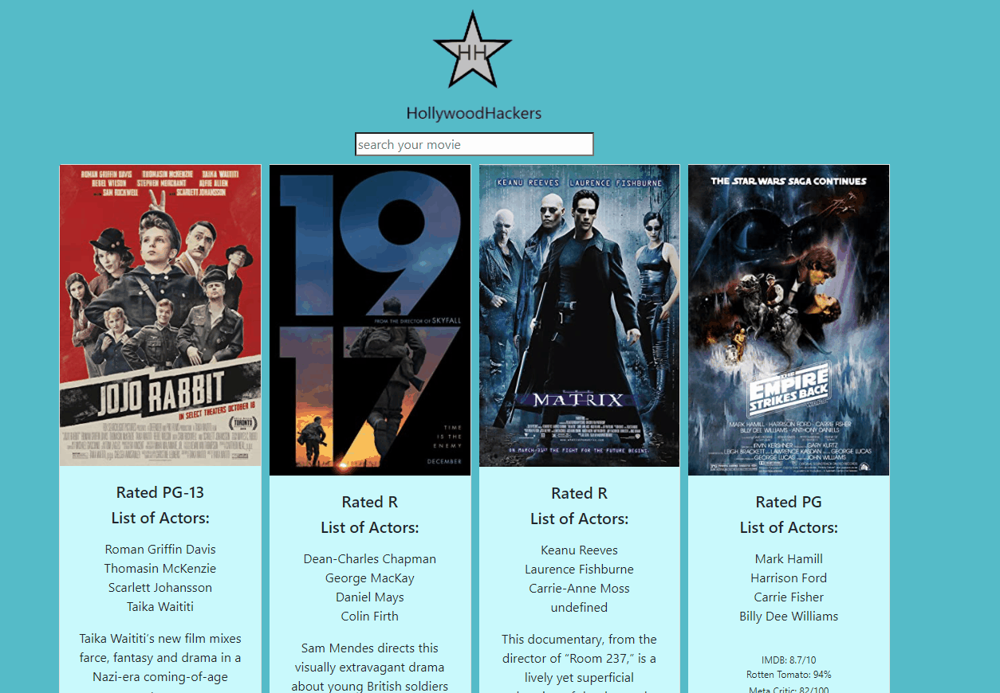

# Group Project 1 - hollywoodHackers

On load page will show 4 cards with randomly generated movie titles and appended movie information via fetch omdb api function. Fetch ny times api function will also generate text from movie review column to be appended. User is able to search through the input field for a movie of their choice. Unordered list is appended to input to dynamically append list items containing locally stored search history up to a maximum of 6 titles. User can click on line item to automatically search for previously searched movie title. The star logo has fun css that will cause it to spin if hovered over.

## Demo

  
## Lessons Learned

This was our first team project for coding bootcamp. We learned quite a bit while working together and overcoming difficulties that arose. Early on the biggest challenge was locating free apis that would fit our original idea and design concept. In the future it may be best to first obtain usable apis before wireframing and settling on proof of concept. Luckily we were able to locate enough endpoint data that fit our original design and intent to a degree, so we did not have to start from scratch. Other difficulties involved teammates dropping out throughout the course of the project. Right off the bat one student had decided to drop out before we even had our first meeting, and we lost 2 more along the way. About halfway through and towards the end it was myself and Eulalie that handled majority of the project. We learned how to utilize the project feature in gitHub to a degree and definitely saw the value, but I don't believe we fully utilized to its potential outside of initial brainstorming session. We were unfortunate to lose many teammates along the way however, it was also a blessing as we had less issues with merging since I handled most of JavaScript and Eulalie handled most of CSS. All in all, it was a telling experience with many lessons learned in collaborating together with others. We look forward to our future projects with other classmates as we continue to strengthen our full stack knowledge.

  
## Deployment

https://eccentricality.github.io/hollywoodHackers/

  